# Elintarvikepeli

Elintarvikepeli on ryhmätyönä toteutettu mobiilipeli, joka on toteutettu keväällä 2021 Haaga-Helian kurssilla Ohjelmointiprojekti 2.

Peli hyödyntää Terveyden ja hyvinvoinnin laitos [Finelin](https://fineli.fi/fineli/fi/ohje/19) dataa.

Halusimme luoda pelin, joka olisi samaan aikaan opettavainen ja hauska. Käyttäjä oppii tekoälyä vastaan pelatessaan millaisia ravintosisältöjä eri tuotteilla on.

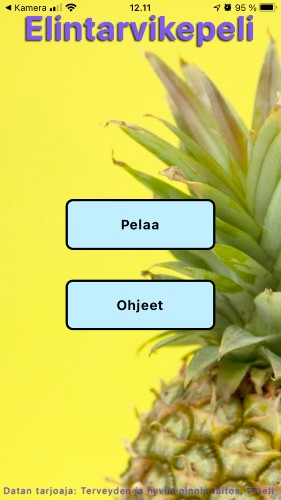

## Rakenne

Sovellus on [React Native](https://reactnative.dev/) pohjainen mobiilisovellus, jossa on hyödynnetty seuraavia kirjastoja:

- [react-native-collapsible-view](https://www.npmjs.com/package/@eliav2/react-native-collapsible-view)
- [react-navigation-stack](https://www.npmjs.com/package/react-navigation-stack)
- [react-native-countdown-circle-timer](https://www.npmjs.com/package/react-native-countdown-circle-timer)
- [react-native-dropdown-picker](https://www.npmjs.com/package/react-native-dropdown-picker)
- [react-native-snap-carousel](https://www.npmjs.com/package/react-native-snap-carousel)
- [react-native-vector-icons](https://www.npmjs.com/package/react-native-vector-icons)

Peli toimii Androidissa ja iPhonessa.

Backend ja sen tarkempi dokumentaatio löytyvät osoitteesta https://elintarvikepeli.herokuapp.com/.

## Käyttäminen paikallisesti

Käyttääksesi sovellusta paikallisesti, sinulla tulee olla asennettuna seuraavat:
- [Node.js npm](https://nodejs.org/en/)
- [Expo CLI](https://docs.expo.io/workflow/expo-cli/)
- [Git](https://git-scm.com/)
- Puhelimeen asennettava Expo Go -sovellus, joka löytyy mobiililaitteiden sovelluskaupoista  ilmaiseksi, tai
Android/iOS-emulaattori
- Kehitysympäristö, esimerkiksi [VSCode](https://code.visualstudio.com/)

Projektin voi kloonata komennolla

 
    $ git clone https://github.com/Super-Pahkina/korttipeli.git
 

  Osoitteesta https://docs.github.com/en/github/creating-cloning-and-archiving-repositories/cloning-a-repository löytyvät tarkemmat ohjeet projektin kloonaamiseksi.

Aja projektin juurihakemistossa komento riippuvuuksien lataamiseksi.

 
 
    $ npm install
 

Projekti käynnistyy seuraavalla komennolla projektin juurihakemistossa.

    $ expo start

 

Oletusselain siirtyy Expon sivulle, jonne ilmestyy QR-koodi. Lue QR-koodi mobiililaitteesi kameralla käynnistääksesi sovelluksen.

### Jatkokehitysajatuksia
- Moninpeli
- Käyttäjätunnuksen luominen (saavutukset, avatar yms)
- Animaatiot
- Peliäänet
--------------

### Työryhmä

- Markus Karjalainen
- Joni Karvinen
- Valtteri Korhonen
- Ville Koski
- Kristiina Kumila

-------------
# Pelin kulku

### Pelin asetukset
Käyttäjä aloittaa pelaamisen valitsemalla pelin asetuksista vuoroajan pituuden, voittoon tarvittavat pisteet ja pelattavan kategorian. 

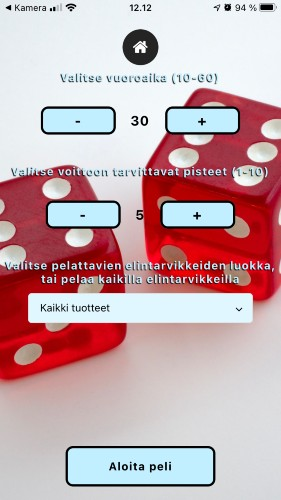
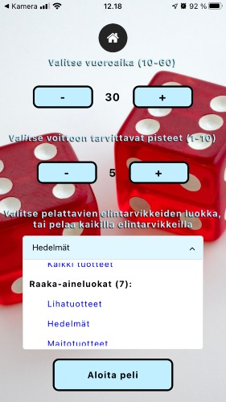

### Pakan valinta
Käyttäjä siirtyy pakanvalintasivulle, jossa on mahdollisuus valita ruudulla olevista vaihtoehdoista elintarvikekortteja omaan pakkaan tai arpoa pelattavat kortit.
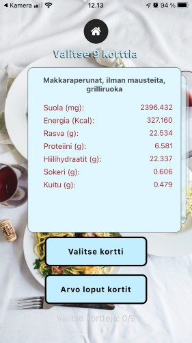
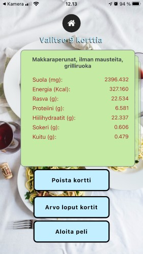

### Käyttäjän vuoro
Peli alkaa käyttäjän vuorolla, jonka aikana hän voi valita pakastaan pelattavan elintarvikekortin. Valitusta kortista valitaan ravintoarvo, joka todennäköisimmin on suurempi kuin vastustajalla. 

Ravintoarvot: suola (mg), energia (kilokalorit), rasva (g), proteiini (g), hiilihydraatti (g), sokeri (g), kuitu (g). 

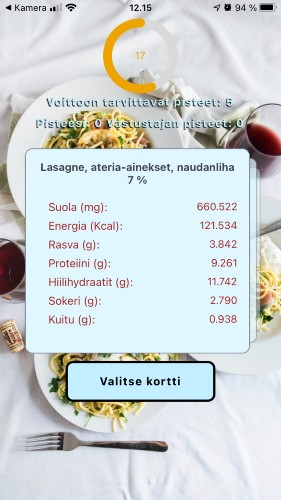

### Kierroksen tulos
Ruudulle tulostuu pelatun kierroksen tulos. Ruudun yläosassa näkyy vastustajan kortti. Käyttäjän pelaama kortti on ruudun alaosassa. Jokaisen ravintoarvon perään tulostuu värillinen ikoni kuvaamaan, oliko kortilla oleva kyseinen ravintoarvo suurempi, pienempi tai yhtäsuuri kuin vastustajalla.

Käyttäjä saa pisteen mikäli käyttäjän kortilla oleva valittu ravintoarvo on suurempi tai yhtäsuuri kuin vastustajalla.

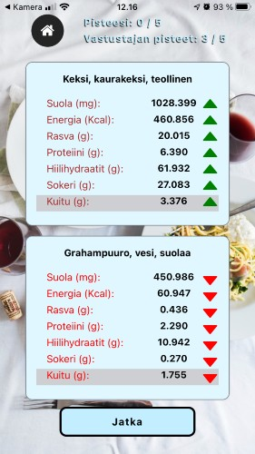

 ### Vastustajan vuoro
Vuoro siirtyy vastustajalle. Ruudun yläreunaan tulostuu vastustajan valitsema ravintoarvokategoria.
Käyttäjä valitsee omasta pakastaan mielestään sopivimman kortin pelattavaksi vastustajan valitsemaa kategoriaa vastaan.

Peli siirtyy kierroksen tulossivulle. Peli jatkuu vuorotellen käyttäjän ja vastustajan vuoroilla, kunnes alussa asetettu voittopistemäärä on saavutettu.

## Erikoiskortit
Pelissä on kahdenlaisia erikoiskortteja.

### Timanttikortti
Timanttikortissa yksi tai useampi ravintoarvo on huomattavasti keskimääräistä korkeampi, joten voittotodennäköisyys on suuri. Jos kierroksen häviää pelattuaan timanttikortin, vastustaja saa ylimääräisen pisteen. 

Timanttikortin tunnistaa elintarvikkeen nimen edessä olevasta timantti-ikonista.

### Lumikortti
Lumikortissa kaikki ravintoarvot ovat keskimääräistä alhaisemmat, joten voittotodennäköisyys on pieni. Jos kierroksen voittaa pelattuaan lumikortin, käyttäjä saa ylimääräisen pisteen. 

Lumikortin tunnistaa elintarvikkeen nimen edessä olevasta lumihiutaleikonista. 

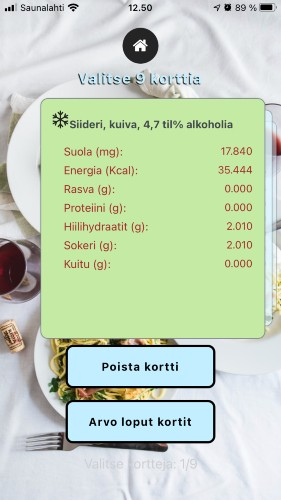
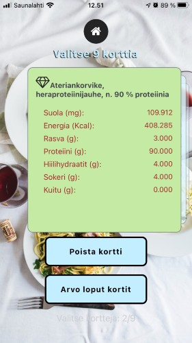

### Pelin tulos

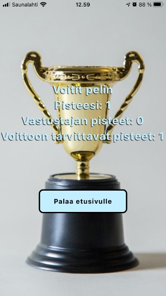
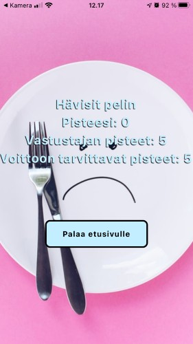

